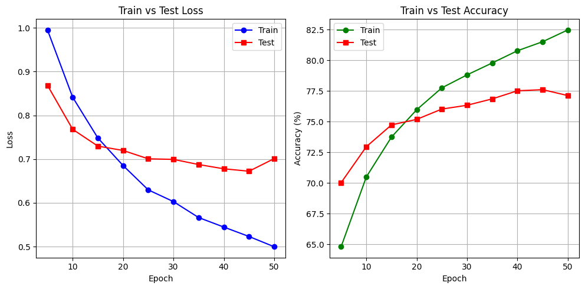

# Performance with base version wihout HRM

It uses CNN as front and an LSTM as the recurrent block. The LSTM block does 1024 unravels.

```
Epoch 1, Loss: 1.5352, Train Accuracy: 44.55%
Epoch 2, Loss: 1.2361, Train Accuracy: 55.71%
Epoch 3, Loss: 1.1229, Train Accuracy: 60.14%
Epoch 4, Loss: 1.0489, Train Accuracy: 62.94%
Epoch 5, Loss: 0.9953, Train Accuracy: 64.80%
Test Loss: 0.8687, Test Accuracy: 70.02%
Epoch 6, Loss: 0.9560, Train Accuracy: 66.52%
Epoch 7, Loss: 0.9209, Train Accuracy: 67.54%
Epoch 8, Loss: 0.8898, Train Accuracy: 68.61%
Epoch 9, Loss: 0.8595, Train Accuracy: 69.64%
Epoch 10, Loss: 0.8414, Train Accuracy: 70.49%
Test Loss: 0.7681, Test Accuracy: 72.95%
Epoch 11, Loss: 0.8151, Train Accuracy: 71.14%
Epoch 12, Loss: 0.7938, Train Accuracy: 72.11%
Epoch 13, Loss: 0.7862, Train Accuracy: 72.22%
Epoch 14, Loss: 0.7612, Train Accuracy: 73.30%
Epoch 15, Loss: 0.7483, Train Accuracy: 73.74%
Test Loss: 0.7297, Test Accuracy: 74.73%
Epoch 16, Loss: 0.7373, Train Accuracy: 74.18%
Epoch 17, Loss: 0.7291, Train Accuracy: 74.21%
Epoch 18, Loss: 0.7105, Train Accuracy: 74.97%
Epoch 19, Loss: 0.6981, Train Accuracy: 75.41%
Epoch 20, Loss: 0.6854, Train Accuracy: 75.96%
Test Loss: 0.7198, Test Accuracy: 75.18%
Epoch 21, Loss: 0.6788, Train Accuracy: 76.09%
Epoch 22, Loss: 0.6653, Train Accuracy: 76.67%
Epoch 23, Loss: 0.6486, Train Accuracy: 77.05%
Epoch 24, Loss: 0.6442, Train Accuracy: 77.18%
Epoch 25, Loss: 0.6297, Train Accuracy: 77.75%
Test Loss: 0.7007, Test Accuracy: 76.02%
Epoch 26, Loss: 0.6268, Train Accuracy: 77.94%
Epoch 27, Loss: 0.6260, Train Accuracy: 77.84%
Epoch 28, Loss: 0.6148, Train Accuracy: 78.39%
Epoch 29, Loss: 0.6098, Train Accuracy: 78.46%
Epoch 30, Loss: 0.6029, Train Accuracy: 78.81%
Test Loss: 0.6994, Test Accuracy: 76.33%
Epoch 31, Loss: 0.5944, Train Accuracy: 78.98%
Epoch 32, Loss: 0.5914, Train Accuracy: 79.12%
Epoch 33, Loss: 0.5881, Train Accuracy: 79.35%
Epoch 34, Loss: 0.5745, Train Accuracy: 79.89%
Epoch 35, Loss: 0.5664, Train Accuracy: 79.78%
Test Loss: 0.6876, Test Accuracy: 76.85%
Epoch 36, Loss: 0.5641, Train Accuracy: 80.25%
Epoch 37, Loss: 0.5593, Train Accuracy: 80.30%
Epoch 38, Loss: 0.5544, Train Accuracy: 80.60%
Epoch 39, Loss: 0.5529, Train Accuracy: 80.44%
Epoch 40, Loss: 0.5447, Train Accuracy: 80.77%
Test Loss: 0.6779, Test Accuracy: 77.51%
Epoch 41, Loss: 0.5396, Train Accuracy: 80.93%
Epoch 42, Loss: 0.5404, Train Accuracy: 81.09%
Epoch 43, Loss: 0.5290, Train Accuracy: 81.32%
Epoch 44, Loss: 0.5225, Train Accuracy: 81.48%
Epoch 45, Loss: 0.5232, Train Accuracy: 81.51%
Test Loss: 0.6723, Test Accuracy: 77.60%
Epoch 46, Loss: 0.5108, Train Accuracy: 82.01%
Epoch 47, Loss: 0.5194, Train Accuracy: 81.91%
Epoch 48, Loss: 0.5088, Train Accuracy: 82.15%
Epoch 49, Loss: 0.5077, Train Accuracy: 82.00%
Epoch 50, Loss: 0.4997, Train Accuracy: 82.47%
Test Loss: 0.7011, Test Accuracy: 77.12%
```

