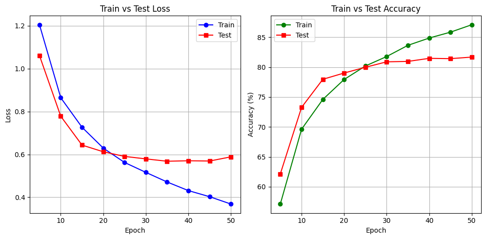

Epoch 1, Loss: 1.9839, Train Accuracy: 17.97%
Epoch 2, Loss: 1.7355, Train Accuracy: 30.75%
Epoch 3, Loss: 1.4587, Train Accuracy: 45.29%
Epoch 4, Loss: 1.3011, Train Accuracy: 52.59%
Epoch 5, Loss: 1.2049, Train Accuracy: 57.12%
Test Loss: 1.0612, Test Accuracy: 62.14%
Epoch 6, Loss: 1.1359, Train Accuracy: 59.84%
Epoch 7, Loss: 1.0510, Train Accuracy: 63.26%
Epoch 8, Loss: 0.9711, Train Accuracy: 65.71%
Epoch 9, Loss: 0.9124, Train Accuracy: 67.75%
Epoch 10, Loss: 0.8643, Train Accuracy: 69.62%
Test Loss: 0.7780, Test Accuracy: 73.27%
Epoch 11, Loss: 0.8322, Train Accuracy: 70.92%
Epoch 12, Loss: 0.8001, Train Accuracy: 71.72%
Epoch 13, Loss: 0.7661, Train Accuracy: 73.04%
Epoch 14, Loss: 0.7396, Train Accuracy: 73.97%
Epoch 15, Loss: 0.7266, Train Accuracy: 74.60%
Test Loss: 0.6434, Test Accuracy: 77.96%
Epoch 16, Loss: 0.6989, Train Accuracy: 75.52%
Epoch 17, Loss: 0.6789, Train Accuracy: 76.14%
Epoch 18, Loss: 0.6655, Train Accuracy: 76.65%
Epoch 19, Loss: 0.6519, Train Accuracy: 77.14%
Epoch 20, Loss: 0.6293, Train Accuracy: 77.93%
Test Loss: 0.6122, Test Accuracy: 79.01%
Epoch 21, Loss: 0.6187, Train Accuracy: 78.40%
Epoch 22, Loss: 0.6034, Train Accuracy: 78.80%
Epoch 23, Loss: 0.5890, Train Accuracy: 79.16%
Epoch 24, Loss: 0.5765, Train Accuracy: 79.87%
Epoch 25, Loss: 0.5623, Train Accuracy: 80.18%
Test Loss: 0.5906, Test Accuracy: 79.97%
Epoch 26, Loss: 0.5550, Train Accuracy: 80.35%
Epoch 27, Loss: 0.5455, Train Accuracy: 80.86%
Epoch 28, Loss: 0.5348, Train Accuracy: 81.20%
Epoch 29, Loss: 0.5247, Train Accuracy: 81.53%
Epoch 30, Loss: 0.5162, Train Accuracy: 81.77%
Test Loss: 0.5790, Test Accuracy: 80.88%
Epoch 31, Loss: 0.5034, Train Accuracy: 82.15%
Epoch 32, Loss: 0.4940, Train Accuracy: 82.65%
Epoch 33, Loss: 0.4905, Train Accuracy: 82.84%
Epoch 34, Loss: 0.4785, Train Accuracy: 83.07%
Epoch 35, Loss: 0.4712, Train Accuracy: 83.64%
Test Loss: 0.5681, Test Accuracy: 80.95%
Epoch 36, Loss: 0.4605, Train Accuracy: 83.64%
Epoch 37, Loss: 0.4623, Train Accuracy: 83.83%
Epoch 38, Loss: 0.4459, Train Accuracy: 84.47%
Epoch 39, Loss: 0.4421, Train Accuracy: 84.36%
Epoch 40, Loss: 0.4311, Train Accuracy: 84.85%
Test Loss: 0.5703, Test Accuracy: 81.46%
Epoch 41, Loss: 0.4297, Train Accuracy: 84.91%
Epoch 42, Loss: 0.4191, Train Accuracy: 85.26%
Epoch 43, Loss: 0.4098, Train Accuracy: 85.55%
Epoch 44, Loss: 0.4076, Train Accuracy: 85.61%
Epoch 45, Loss: 0.4025, Train Accuracy: 85.84%
Test Loss: 0.5691, Test Accuracy: 81.41%
Epoch 46, Loss: 0.3919, Train Accuracy: 86.20%
Epoch 47, Loss: 0.3944, Train Accuracy: 86.20%
Epoch 48, Loss: 0.3823, Train Accuracy: 86.44%
Epoch 49, Loss: 0.3730, Train Accuracy: 86.76%
Epoch 50, Loss: 0.3683, Train Accuracy: 87.08%
Test Loss: 0.5886, Test Accuracy: 81.67%